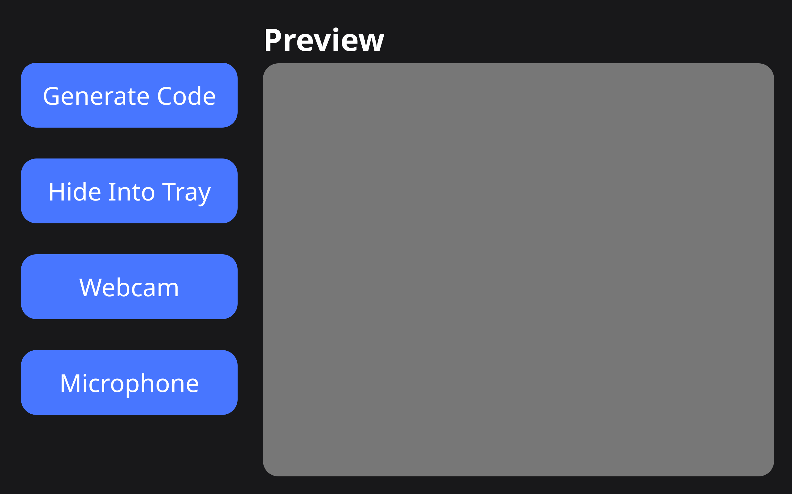
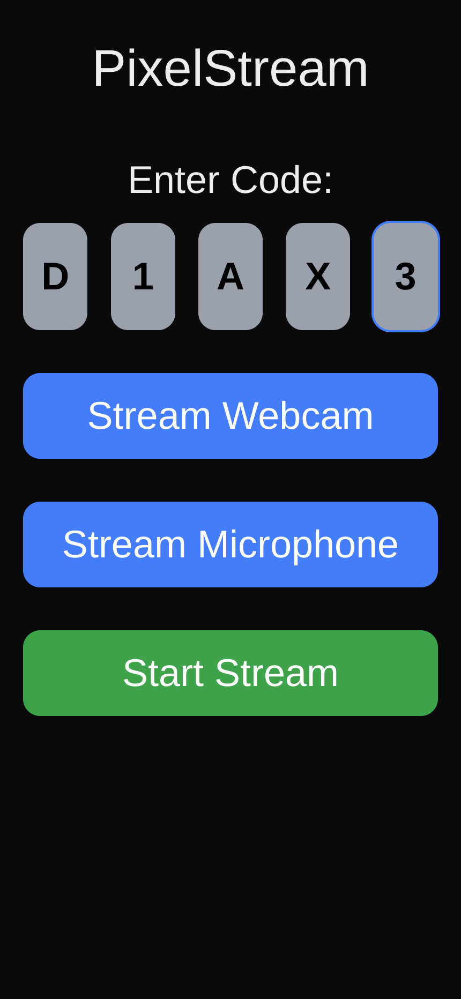

# PixelStreamer 🎥

**PixelStreamer** is a secure, real-time webcam and microphone streaming application that enables peer-to-peer (P2P) communication between your phone and your Linux desktop using WebRTC. The project uses Firebase as a signaling server via Cloud Functions, with a beautiful native Qt UI on the desktop side and a modern React/Next.js frontend on mobile.

---

## 🚀 Features

- 🔐 **Secure 5-character pairing code** to initiate a connection
- 🖥️ **Qt-based native desktop app** (Linux)
- 📱 **React-based phone UI** (Next.js + WebRTC)
- ☁️ **Serverless Firebase backend** (Cloud Functions + Firestore)
- 🎥 Real-time video/audio streaming from phone to laptop
- 🔄 Automatic connection cleanup and lifecycle management
- 📦 Lightweight and fast — perfect for remote webcam use, streaming, or telepresence

---

## 🏗️ Architecture

1. The QtPython Linux app requests code from a firebase function [generateCode](https://generatecode-qaf2yvcrrq-uc.a.run.app)
2. The Linux app begins polling for an SDP offer using a firebase function [checkOffer](https://checkoffer-qaf2yvcrrq-uc.a.run.app)
3. The code is entered on the Home component of the Next.js Mobile PWA
4. The PWA validates the code using a firebase function [validateCode](https://validatecode-qaf2yvcrrq-uc.a.run.app)
5. The PWA routes to the Stream Page component of the Next.js Mobile PWA
6. The Stream Page component generates a SDP offer and ICE candidates
7. The PWA updates the code doc in the firestore with the SDP offer via firebase function [submitOffer](https://submitoffer-qaf2yvcrrq-uc.a.run.app)
8. The PWA begins polling for an SDP answer via a firebase function [checkAnswer](https://checkanswer-qaf2yvcrrq-uc.a.run.app)
9. The QtPython Linux app detects a SDP offer and generates an SDP answer with ICE candidates
10. The Linux app updates the code doc with the SDP answer and the ICE candidates through a firebase function [submitAnswer](https://submitanswer-qaf2yvcrrq-uc.a.run.app)
11. The PWA detects an SDP answer and establishes a connection

---

## 🛠️ Tech Stack

| Component | Technology |
|----------|------------|
| 📱 Phone Frontend | React + Next.js + Tailwind CSS + TypeScript + WebRTC |
| 🖥️ Laptop App | Python 3 + PyQt5 + aiortc |
| ☁️ Backend | Firebase (Firestore, Cloud Functions, Hosting) |
| 🔄 Signaling | Firebase Firestore |
| 🧪 Media | WebRTC Peer-to-Peer |

## 🖼️ Screenshots

### Laptop App (Qt UI)


### Phone App (React Web)



### TODO:
Add renegotiation logic for WebRTC

Expiry for Codes
Add TTL logic or clean-up mechanism:
```
// Suggestion: Add this field when setting the code
expiresAt: admin.firestore.Timestamp.fromDate(new Date(Date.now() + 10 * 60 * 1000)) // 10 mins
```
Add a scheduled function to remove expired codes.

Limit CORS to only the deployed link

Rate Limiting or Abuse Protection
Use Firebase App Check or limiting requests per IP.

Additional Logging
Log the actual code being generated and track failures more granularly:
```
functions.logger.info("Generated Code:", code);
```

Type Safety & Input Validation
Use a schema validator (e.g. Zod or Joi) in production for complex payloads like SDP.

Secure Data Structuring
Move signaling data into subcollections under /codes/{code}/signals if you want finer access control.
Mask or encrypt metadata.